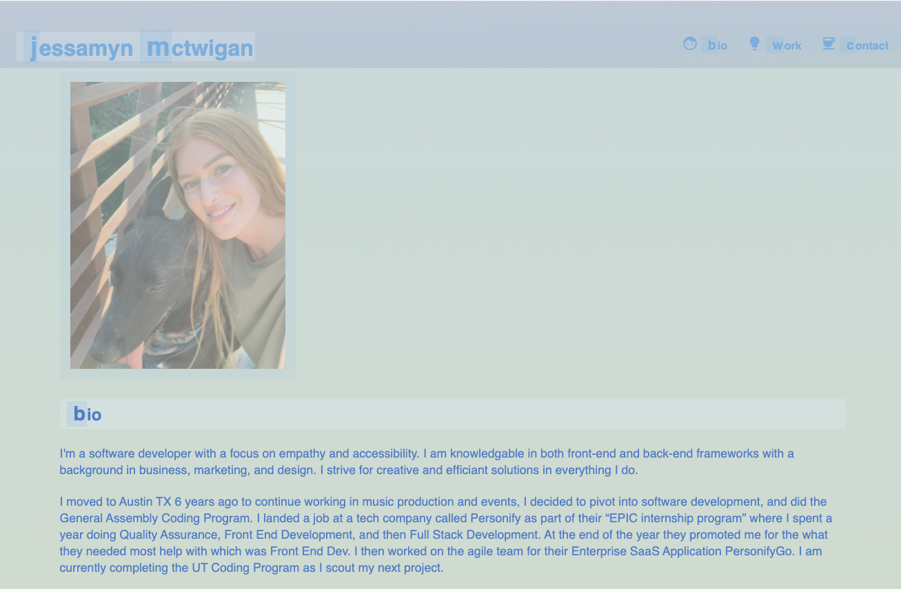
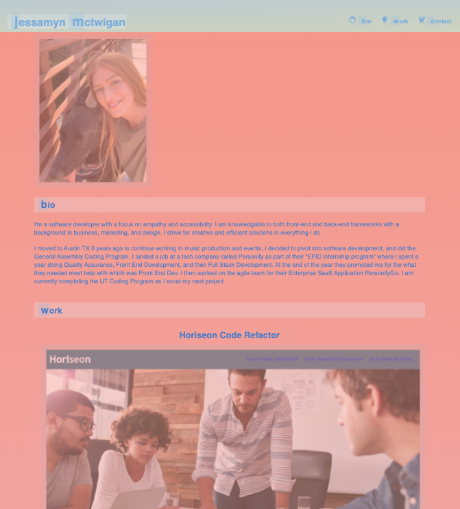
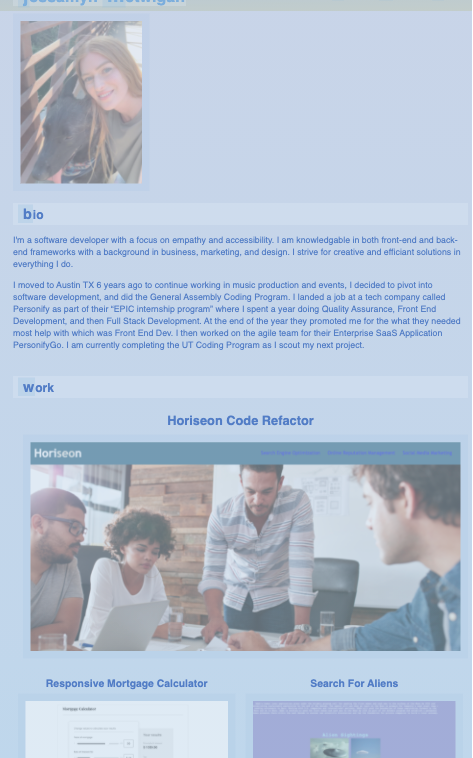
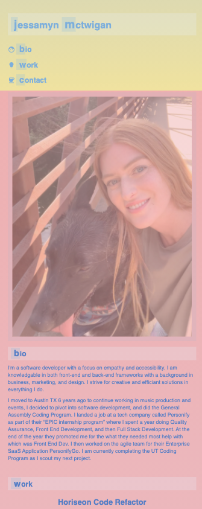

# Profile Website with HTML and CSS

#### Created a Personal Portfolio Websiteusing html, css and responsve techniques like flexbox, @media and css selectors

## Table of Contents

**[Quick Links](#Quick-Links)** 
**[First Looks](#First-Looks)** 
**[Wireframes](#Wireframes)** 
**[Bugs and Known Issues](#Bugs-and-Known-Issues)** 
**[Next Steps to Continue](#Next-Steps-to-Continue)** 
**[Acceptance Criteria](#Acceptance-Criteria)** 
**[Bonus](#Bonus)** 
**[Deliverables](#Deliverables)** 
**[License](#License)** 

## Quick Links

- click here to view --> [final website](https://jessamyn27.github.io/2-Profile-Website-with-HTML-and-CSS/)

- click here too view --> [homework assignment details](https://github.com/the-Coding-Boot-Camp-at-UT/UTA-VIRT-FSF-FT-06-2021-U-LOL/tree/master/02-Advanced-CSS/02-Homework)

- click here to view --> [README GUIDE from UT](https://github.com/the-Coding-Boot-Camp-at-UT/UTA-VIRT-FSF-FT-06-2021-U-LOL/blob/master/01-HTML-Git-CSS/02-Homework/Homework-Guide/README.md)

## First Looks

# 

# 

# 

# 

## Wireframes - n/a

## Bugs and Known Issues

- More contact info and responsive UI clean up needed

## Next Steps to Continue

### Next Steps for App UI and Functionality

- More accessiblity like hover text info
- More browser compatibility css and @media queries to clean up some responsive scaling
- Add more accessibility (label ever form control / page lang idenity / all interactive elements keyboard accessible like sliders)
- Hover, Focus and other accessibilty standards need some tweaking
- test and clean up run time efficiency based on Google Analytics (organize acct structure / includes and excludes checklist ect..)
- Code Clean up CSS: set up global variables in SCSS for reusables (fonts, colors, headings and other elements ect...)
- Create more reusable classes and class combos in CSS as well as changing some classes to id's if only used once
- Set more standards for basic elements in CSS
- add Sass or Less structure that compiles to one CSS for code organizastion and better css nesting/functional variables 

### Next Steps for Code

- GIVEN I need to sample a potential employee's previous work
- WHEN I load their portfolio
- THEN I am presented with the developer's name, a recent photo, and links to sections about them, their work, and how to contact them
- WHEN I click one of the links in the navigation
- THEN the UI scrolls to the corresponding section
- WHEN I click on the link to the section about their work
- THEN the UI scrolls to a section with titled images of the developer's applications
- WHEN I am presented with the developer's first application
- THEN that application's image should be larger in size than the others
- WHEN I click on the images of the applications
- THEN I am taken to that deployed application
- WHEN I resize the page or view the site on various screens and devices
- THEN I am presented with a responsive layout that adapts to my viewport

### My Interpretation of the Acceptance Criteria:
- homework 2 acceptance criteria:
- display name
- display profile photo
- 3 sections in nav that are links that when clicked scroll to the section in the page:
- about paragraph
- body of work
- contact info
- body of work should have:
- titles with images/screenshots of work 3 - 5 examples (fake for now)
- first image is larger than the other
- all images are clickable links that take to the deployed app (fake for now) that the image/screenshot shows
- entire page is responsive from desktop (max 990 or so) to mobile (min 300px or so) 
- encouraged to use what we just learned to make this happen: flexbox / @media queries / css variables

## Grading Requirements

- This homework is graded based on the following criteria: 

### Technical Acceptance Criteria: 40%

* Satisfies all of the above acceptance criteria.

### Deployment: 32%

* Application deployed at live URL.

* Application loads with no errors.

* Application GitHub URL submitted.

* GitHub repository contains application code.

### Application Quality: 15%

* Application resembles the mock-up functionality provided in the homework instructions.

### Repository Quality: 13%

* Repository has a unique name.

* Repository follows best practices for file structure and naming conventions.

* Repository follows best practices for class/id naming conventions, indentation, quality comments, etc.

* Repository contains multiple descriptive commit messages.

* Repository contains quality readme with description, screenshot, link to deployed application.

## Review

You are required to submit BOTH of the following for review:

* The URL of the deployed application.

* The URL of the GitHub repository that contains your code. Give the repository a unique name and include a README file that describes the project.

### Bonus

- 1. Transpile JS for compatibility with other browsers (Safari/iOS)
- 2. Use of the Airbnb style guide
- 3. Unit tests for critical functions
- 4. Use JSDocs 3 pattern for comments
- 5. Write a list of bugs or known issues for your implementation if needed

### Deliverables

- 1. All source files (ES6 and SCSS)
- 2. HTML and CSS files (unminified)
- 3. GitHub repository link in UT Portal
- 4. Gitpages live website link in UT Portal

### License

[MIT License](https://opensource.org/licenses/MIT)

**[Back Up To Top](#Profile-Website-with-HTML-and-CSS)**
